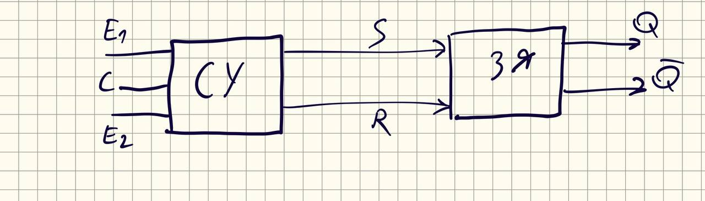
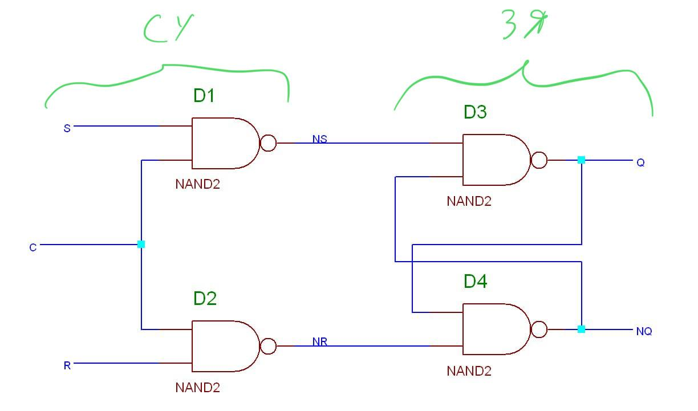
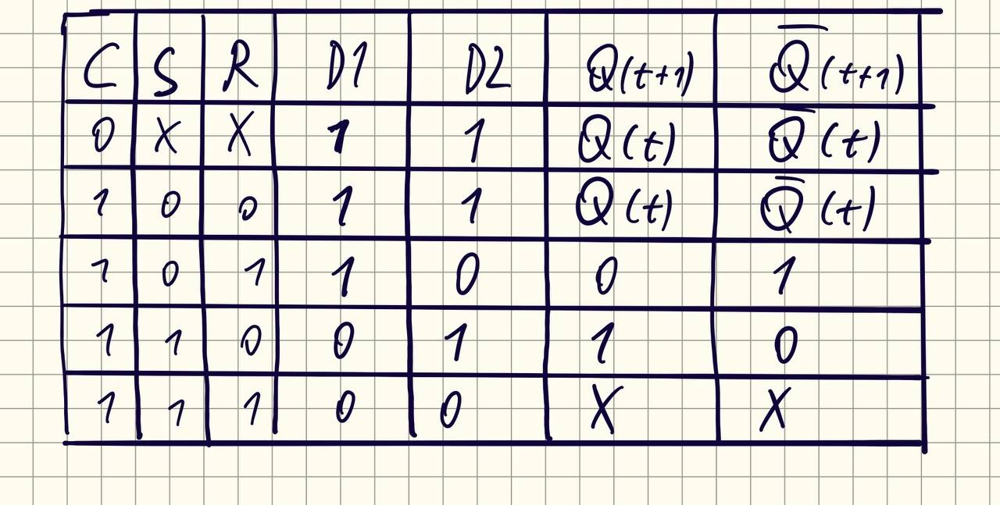
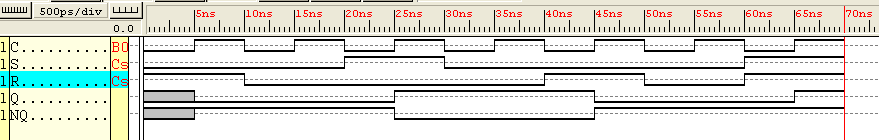

# Latch  
Latch или тригер - простейшая бистабильная ячейка памяти, хранящая один бит информации. Часто с управляющими надстройками для различных действий над хранимым значением.  

## Схемное представление  
В общем виде любой latch выглядит так  

Здесь:  
**СУ** - схема управления, реализующая те самые различные действия над хранимым значением: запись 1/0, хранение, инверсия.  
**E1, E2** - кастомные управляющие сигналы.  
**C** - clock.  Для синхронных триггеров.  
**ЗЯ** - запоминающая ячейка.  
**SR** - сигналы set и reset.  
**Q** - хранимое значение.  

Для простоты буду использовать реализацию синхронного SR триггера.  
Схемно она реализуется следующим образом на элементах И-НЕ:  

И таблица переходов для этого триггера:  

В данном случае всё, что делает схема управления, просто инвертирует сигналы Set и Reset и разрешает их подачу только при поступлении клока. В противном случае(если синхросигнал не поступает), на выходах D1 и D2 будут единички, т.е. хранение текущего состояния.  
Set=1, Reset=1 является запрещённой комбинацией. Если её подать, то триггер находится в неопределённом состоянии.  
## Waveform  

Диаграмма работы триггера:  

События на диаграмме по клокам:  
**0ns**: триггер в неопределённом состоянии  
**5ns**: заресетили триггер в ноль  
**15ns**: храним ноль  
**25ns**: засетили триггер в единицу  
**35ns**: храним единицу  
**45ns**: сбросили в ноль  
**55ns**: храним ноль  
**65ns**: подаём запрещённую комбинацию.  
> На диаграмме хоть и показано, что Q и NQ оба равны единице, но в реальности они просто равны и их значения неопределены.  
