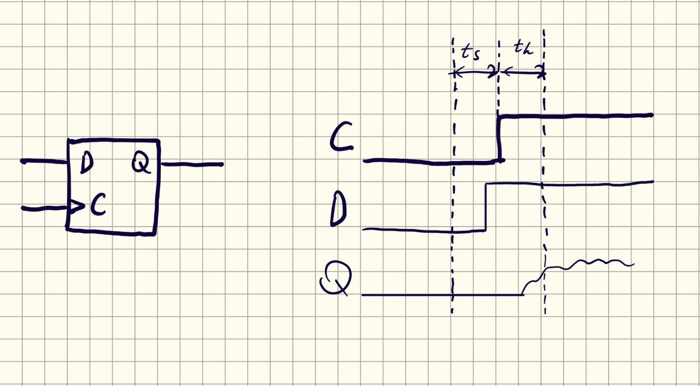
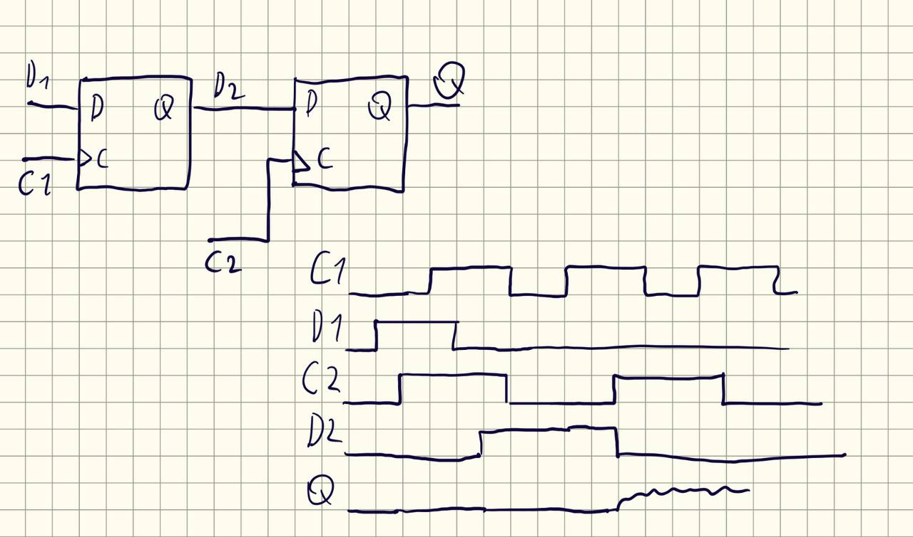
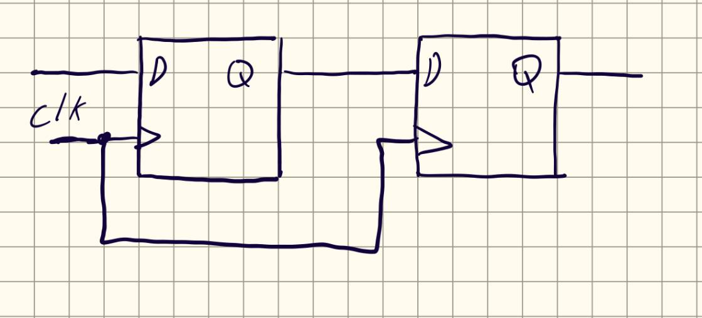
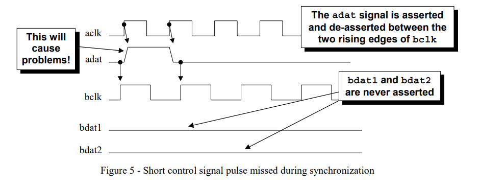
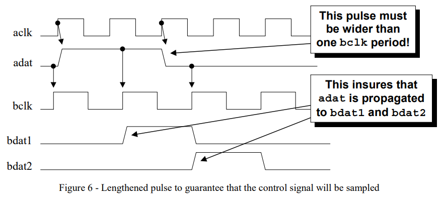
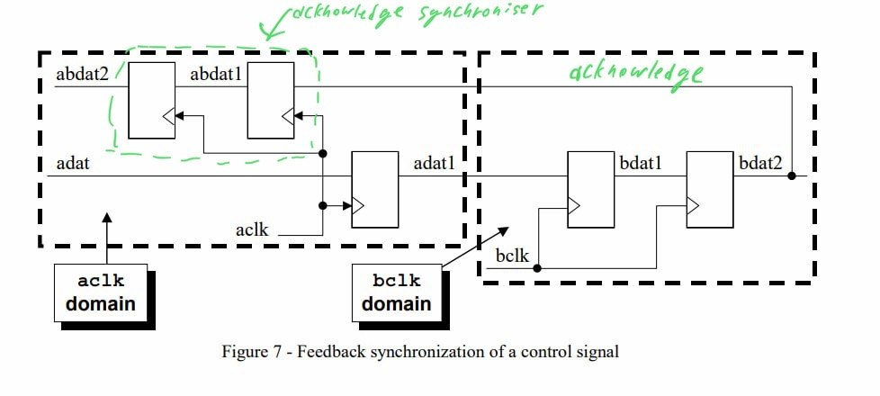

# Метастабильность  

**Метастабильность** это нестабильность или непредсказуемость сигнала, возникающая при изменении некоторого другого сигнала слишком близко к фронту клока.  

> Под "слишком близко" имеется в виду с нарушением setup и hold time.  

Нестабильность сигнала заключается в том, что сигнал какое-то время висит между уровнями 0 и 1 и требует время на то, чтобы перейти в стабильное состояние, причём данное время заранее не определено, поскольку процесс имеет случайный характер.  

Данное время можно теоретически оценивать, используя MTBF - Mean Time Between Failures - среднее время между нарушениями синхронизации. Обычно учитывают частоты клоков, характеристики самих элементов.  

Метастабильность может приводить к логическим ошибкам в работе схемы.    

Простейший пример - нарушение setup и hold time в D-триггере.  

Но в общем случае такой конфликт может возникать между разными clock domain с разными частотами и/или фазами.  

# Способы борьбы с метастабильностью  
## Синхронизаторы  
Простейшим способом является синхронизатор - добавление ещё одного последовательностного элемента(чаще всего триггера), который бы синхронизировал сигнал на выходе с клоком.  
  
Данный способ скорее уменьшает вероятность появления метастабильности на конечном выходе, чем полностью убирает её. Но, несмотря на простоту, также стоит учитывать, что добавляется временная задержка за счёт ещё одного триггера.   
## Правильное разделение модулей и общие правила  
- Позволять каждому модулю синхронизироваться только одним клоком.  
- Любые сигналы идущие из одного clock domain в другой, должны проходить через  синхронизаторы нового clock domain.  
## Передача сигнала в медленный clock domain  
Есть следующая проблема. В случае, если сигнал, который нужно было передать в другой clock domain слишком быстро переключился(за время меньше периода синхросигнала из clock domain получателя), то clock domain получатель может просто не успеть синхронизировать его.  
Диаграмма для примера:  

Одним из способов решения является просто удержание сигнала на время равное периоду синхросигнала из clock domain получателя.  
  
Дополнительно к этому способу добавляют передачу сигнала подтверждения(acknowledge) из clock domain получателя в clock domain отправитель. Передача происходит также через синхронизатор.  
  
